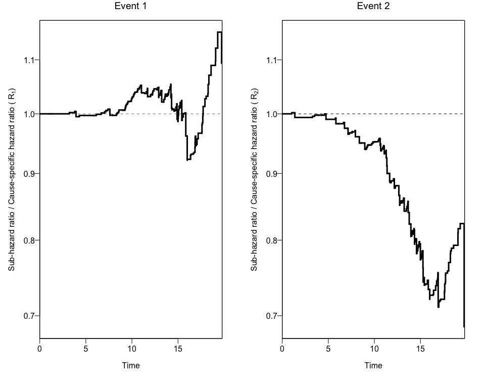
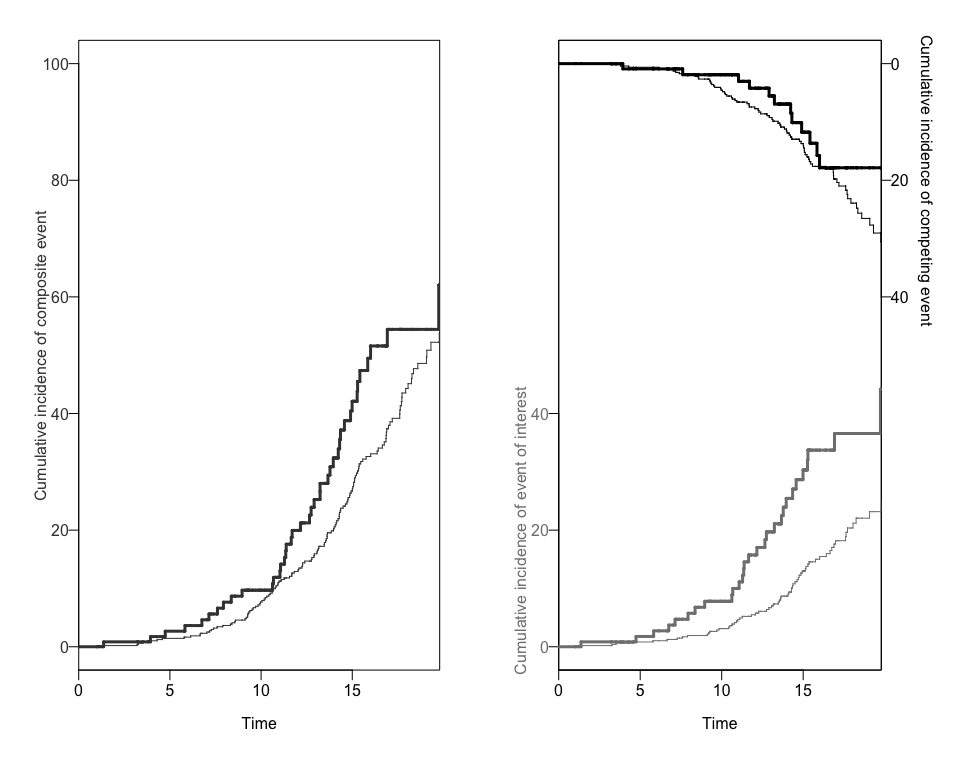
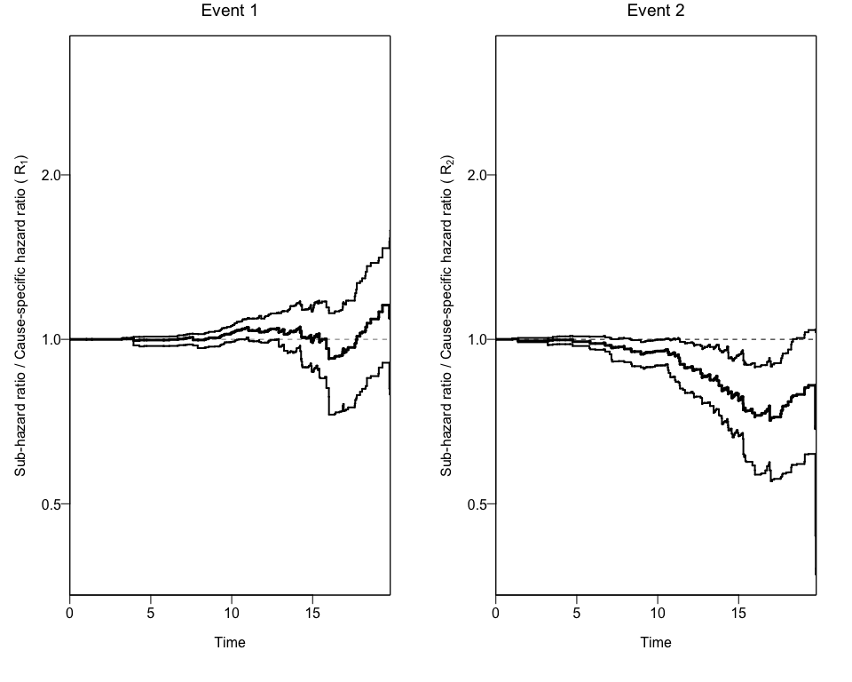

<!-- README.md is generated from README.Rmd. Please edit that file -->

# hrcomprisk: Nonparametric Assessment of Differences Between Competing Risks Hazards

<!-- badges: start -->

<!-- badges: end -->

This package aims to estimate Nonparametric Cumulative-Incidence Based
Estimation of the Ratios of Sub-Hazard Ratios to Cause-Specific Hazard
Ratios.

## Installation

You can install the latest version of `hrcomprisk` in CRAN or the
development version from [Github](https://github.com):

``` r
# Install hrcomprisk from CRAN
install.packages("hrcomprisk")
# Or the development version from GitHub:
# install.packages("devtools")
devtools::install_github("AntiportaD/hrcomprisk")
```

## Using a formatted data set to apply the `hrcomprsk` package

You can use the dataset provided by the authors from the [CKiD
study](https://statepi.jhsph.edu/ckid/), wich has the necessary
variables to run the package.

``` r
library(hrcomprisk)
data <- hrcomprisk::dat_ckid
dim(data) #dimensions
#> [1] 626  13
names(data) #variable names
#>  [1] "b1nb0"        "event"        "male1fe0"     "incomelt30"   "incomegt75"  
#>  [6] "lps"          "foodassist"   "public"       "matedultcoll" "privatemd"   
#> [11] "entry"        "exit"         "inckd"
```

The package will create a `data.frame` object with the cumulative
incidence of each competing risk for each exposure group. We can use the
`CRCumInc`
fuction.

``` r
mydat.CIF<-CRCumInc(df=data, time=exit, event=event, exposed=b1nb0, print.attr=T)
#> $names
#>  [1] "event"       "exposure"    "time"        "CIoinc_comp" "CIxinc_comp"
#>  [6] "CIoinc_1"    "CIxinc_1"    "CIoinc_2"    "CIxinc_2"    "R1"         
#> [11] "R2"         
#> 
#> $class
#> [1] "data.frame"
```

## Using a the output to create Plots of CIFs and the Ratio of Hazard Ratios (Rk)

We can also obtain two different plots using the `plotCIF` function:

1.  The Cumulative Incidence of both events of interest, overall and by
    exposure level, and
2.  The ratios of Hazard ratios (sub-distribution Hazard Ratio and
    cause-specific Hazard Ratio) by
event.

<!-- end list -->

``` r
plots<-plotCIF(cifobj=mydat.CIF, maxtime = 20, eoi = 1)
```



## Bootstrapping the data to get 95% Confidence Intervals for the Ratio of Hazard Ratios (Rk)

In order to get confidence intervals to the ratio of Hazard Ratios (Rk),
we can use the `bootCRCumInc`
function:

``` r
ciCIF<-bootCRCumInc(df=data, exit=exit, event=event, exposure=b1nb0, rep=100, print.attr=T)
#> $names
#> [1] "R1.lower" "R1.upper" "R2.lower" "R2.upper"
#> 
#> $class
#> [1] "data.frame"
```

Finally, we can use this new data to add the 95% Confidence Intervals to
the previous plot using again the `plotCIF`
function.

``` r
plotCIF(cifobj=mydat.CIF, maxtime= 20, ci=ciCIF)
```



## The wrapper function `npcrest`

The package also offers a wrapper function (`npcrest`) to do all these
analyses in one
step.

``` r
npcrest(df=data, exit=exit, event=event, exposure=b1nb0,rep=100, maxtime=20, print.attr=T)
#> $names
#>  [1] "event"       "exposure"    "time"        "CIoinc_comp" "CIxinc_comp"
#>  [6] "CIoinc_1"    "CIxinc_1"    "CIoinc_2"    "CIxinc_2"    "R1"         
#> [11] "R2"         
#> 
#> $class
#> [1] "data.frame"
#> 
#> $names
#> [1] "R1.lower" "R1.upper" "R2.lower" "R2.upper"
#> 
#> $class
#> [1] "data.frame"
```



## References

1.  Ng D, Antiporta DA, Matheson M, Munoz A. Nonparametric assessment of
    differences between competing risks hazard ratios: application to
    racial differences in pediatric chronic kidney disease progression.
    Clinical Epidemiology, 2020. [Link to
    Journal](https://doi.org/10.2147/CLEP.S225763)
2.  Muñoz A, Abraham AG, Matheson M, Wada N. In: Risk Assessment and
    Evaluation of Predictions. Lee MLT, Gail M, Pfeiffer R, Satten G,
    Cai T, Gandy A, editor. New York: Springer; 2013.
    Non-proportionality of hazards in the competing risks framework;
    pp. 3–22. [Google
    Scholar](https://link.springer.com/chapter/10.1007/978-1-4614-8981-8_1)
